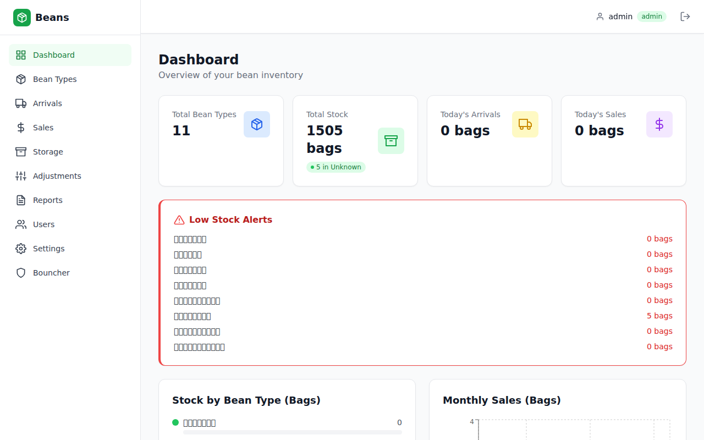
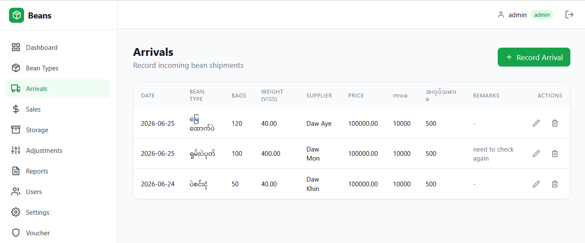
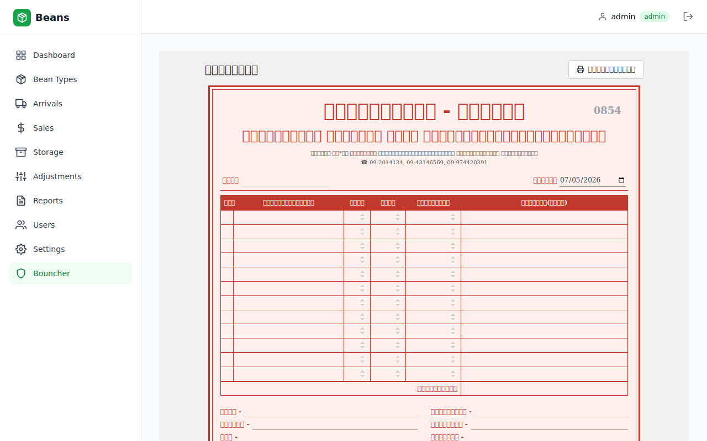

# Beans Inventory Management System

**One-line summary:** Myanmar bean warehouses run on paper — we replace it with a fast, accurate digital system.







## Features

- **Authentication** - JWT-based login with Admin/Staff roles
- **Bean Types** - CRUD for bean type catalog (supports Myanmar names)
- **Arrivals** - Record incoming bean shipments (auto-increments stock)
- **Sales** - Record sales with stock validation (auto-decrements stock)
- **Storage** - Track warehouse storage locations
- **Stock Adjustments** - Correct stock levels with audit trail
- **Dashboard** - Real-time stats, charts, and low-stock alerts
- **Reports** - Daily/Weekly/Monthly/Custom reports with Excel/PDF export
- **Audit Trail** - Full tracking of all operations
- **Dark Mode** - Built-in dark mode support
- **Mobile Responsive** - Works on all devices

## Tech Stack

### Backend
- Python 3.11+
- FastAPI
- SQLAlchemy 2.0 (async)
- PostgreSQL 15+
- JWT Authentication
- Alembic migrations

### Frontend
- React 18 + TypeScript
- Vite
- Tailwind CSS
- React Query (TanStack)
- React Router v6
- Recharts

### Deployment
- Docker + Docker Compose
- Nginx reverse proxy
- GitHub Actions CI

## Quick Start

### Prerequisites
- Python 3.11+
- Node.js 20+
- PostgreSQL 15+

### Backend Setup

```bash
cd backend

# Create virtual environment
python3 -m venv venv
source venv/bin/activate  # Linux/Mac
# or venv\Scripts\activate  # Windows

# Install dependencies
pip install -r requirements.txt

# Create database
createdb beans_inventory

# Run seed script
python scripts/seed.py

# Start server
uvicorn app.main:app --reload --port 8000
```

Backend API: http://localhost:8000
Swagger Docs: http://localhost:8000/docs

### Frontend Setup

```bash
cd frontend

# Install dependencies
npm install

# Start dev server
npm run dev
```

Frontend: http://localhost:5173

### Docker Setup

```bash
# Start all services
docker-compose up --build

# Access the application
# Frontend: http://localhost
# Backend API: http://localhost:8000
# Swagger Docs: http://localhost:8000/docs
```

## Default Credentials

| Username | Password | Role  |
|----------|----------|-------|
| admin    | admin123 | Admin |
| staff    | staff123 | Staff |

## API Endpoints

### Authentication
- `POST /api/auth/login` - Login
- `POST /api/auth/change-password` - Change password
- `GET /api/auth/me` - Get current user

### Bean Types
- `GET /api/bean-types` - List all
- `POST /api/bean-types` - Create
- `GET /api/bean-types/{id}` - Get one
- `PUT /api/bean-types/{id}` - Update
- `DELETE /api/bean-types/{id}` - Delete

### Arrivals
- `GET /api/arrivals` - List all
- `POST /api/arrivals` - Create (auto-increments stock)

### Sales
- `GET /api/sales` - List all
- `POST /api/sales` - Create (validates stock, auto-decrements)

### Storage
- `GET /api/storages` - List all
- `POST /api/storages` - Create

### Stock Adjustments
- `GET /api/adjustments` - List all
- `POST /api/adjustments` - Create (validates decrease doesn't cause negative stock)

### Dashboard
- `GET /api/dashboard` - Get dashboard data

### Reports
- `GET /api/reports` - Generate report
- `GET /api/reports/export/excel` - Export Excel
- `GET /api/reports/export/pdf` - Export PDF

### Users (Admin only)
- `GET /api/users` - List all
- `POST /api/users` - Create
- `PUT /api/users/{id}` - Update
- `DELETE /api/users/{id}` - Delete

### Audit Logs
- `GET /api/audit-logs` - List all with filters

## Business Rules

### Stock Calculation
```
Current Stock = Total Arrivals + Stock Adjustments (increase) - Sales - Stock Adjustments (decrease)
```

### Validation
- Cannot sell more than available stock
- Cannot decrease stock below zero
- All stock movements are recorded
- Every transaction is auditable

## Project Structure

```
Beans-Inventory/
├── backend/
│   ├── app/
│   │   ├── db/          # Database engine & session
│   │   ├── models/      # SQLAlchemy models
│   │   ├── schemas/     # Pydantic schemas
│   │   ├── routers/     # API endpoints
│   │   ├── services/    # Business logic
│   │   └── middleware/   # Error handling
│   ├── tests/           # pytest tests
│   ├── scripts/         # Seed data
│   └── alembic/         # Migrations
├── frontend/
│   ├── src/
│   │   ├── api/         # Axios client
│   │   ├── contexts/    # Auth context
│   │   ├── hooks/       # React Query hooks
│   │   ├── components/  # Reusable components
│   │   ├── pages/       # Page components
│   │   └── types/       # TypeScript types
│   └── public/
├── nginx/               # Nginx config
├── docker-compose.yml
├── Dockerfile
└── README.md
```

## Environment Variables

| Variable | Default | Description |
|----------|---------|-------------|
| DATABASE_URL | postgresql+asyncpg://... | Database connection string |
| SECRET_KEY | ... | JWT secret key |
| CORS_ORIGINS | [...] | Allowed CORS origins |
| DEBUG | false | Debug mode |

## License

MIT
